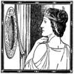

# &nbsp; [Mirror Mirror On the Wall](http://alexa.amazon.com/#skills/amzn1.echo-sdk-ams.app.ec71c2fe-23c0-43c5-a8f5-ef0264cc91f7)
 4

To use the Mirror Mirror On the Wall skill, try saying...

* *Alexa, ask Mirror Mirror On The Wall who is the fairest of them all?*

* *Alexa, ask Mirror Mirror On The Wall*

* *Alexa, ask Mirror Mirror On The Wall who is the fairest?*

Do you remember the Queen in Snow White and her awesome magic mirror? Now you can have your own magic mirror!

Just say "Alexa, ask Mirror Mirror On The Wall who is the fairest of them all?" and like magic Alexa will say something interesting. It could be something reassuring, something wise, something inspirational, something fun, or something even just a little bit strange.

If you ever feel like you need a little pick me up then you need your own magic mirror.

***

### Skill Details

* **Invocation Name:** mirror mirror on the wall
* **Category:** null
* **ID:** amzn1.echo-sdk-ams.app.ec71c2fe-23c0-43c5-a8f5-ef0264cc91f7
* **ASIN:** B017OBQBIC
* **Author:** Possibility Outpost
* **Release Date:** November 6, 2015 @ 14:14:50
* **In-App Purchasing:** No
