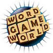

# &nbsp; [Amazing Word Master Game](http://alexa.amazon.com/#skills/amzn1.echo-sdk-ams.app.d6b53286-5fec-4e66-84c4-07ff80e7c58b)
 142

To use the Amazing Word Master Game skill, try saying...

* *Alexa, ask Word Master to play a game*

* *Alexa, ask Word Master to start with "Apple"*

* *Alexa, open Word Master*

Word Master is an interactive way to learn and challenge yourself with words. Alexa starts by saying a word. You then have to respond back with a word that begins with the letter in which Alexa’s word ended. Alexa then does the same in response to your word. As you say words, you earn scores with each word. The longer your word, the higher your score. Compete with Alexa and folks at home to make a higher score. Playing with words was never so much fun!

The game continues until someone fails to respond to the next word or you say Exit.

***

### Skill Details

* **Invocation Name:** word master
* **Category:** Games
* **ID:** amzn1.echo-sdk-ams.app.d6b53286-5fec-4e66-84c4-07ff80e7c58b
* **ASIN:** B017OBSCOS
* **Author:** Bhokaal Labs
* **Release Date:** November 6, 2015 @ 14:16:09
* **In-App Purchasing:** No
