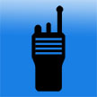

# &nbsp; [Call Sign](http://alexa.amazon.com/#skills/amzn1.echo-sdk-ams.app.892a1ff4-b185-403c-9de9-d81e998dc44e)
 24

To use the Call Sign skill, try saying...

* *Alexa load Call Sign and find november zero uniform sierra mike*

* *Alexa load Call Sign and find kilo alpha two foxtrot november kilo*

* *Alexa ask Call Sign to look up november zero uniform sierra mike*

A user can look up Amateur (HAM) radio call sign information from the FCC public database by giving Alexa the call sign information using the phonetic alphabet.  For instance the call sign N0USM would be spoken as november zero uniform sierra mike.

***

### Skill Details

* **Invocation Name:** call sign
* **Category:** null
* **ID:** amzn1.echo-sdk-ams.app.892a1ff4-b185-403c-9de9-d81e998dc44e
* **ASIN:** B0197GDSL0
* **Author:** Humblebeeapps
* **Release Date:** December 10, 2015 @ 18:43:32
* **In-App Purchasing:** No
