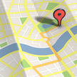

# &nbsp; Drive Time
 17

To use the Drive Time skill, try saying...

* *"Alexa, launch Drive Time."*

* *"Alexa, tell Drive Time to get me the time to work."*

* *"Alexa, ask Drive Time what's the traffic to school."*

On your way out the door and need to know how long it will take to get to where you're going?

Just say, "Alexa, tell Drive Time to get me the time to the store." 

Drive time will tell you the current estimated travel time by car in current traffic conditions. 

After enabling Drive Time, enter your home address and up to five of your most traveled to destinations on the Drive Time page.

To get current destinations on file, you can say, "What are my destinations?"

You can update your destinations on file at any time by saying,  "Update Destinations."

For help, just say "help," after launching the skill.

UPDATE: Locations are now saved! No need to start over if you want to edit your addresses. After saying, 'update destinations' click on the link sent to the card in the Alexa app. (Just make sure to use same device that you last used to enter address information.)

***

### Skill Details

* **Invocation Name:** drive time
* **Category:** Travel
* **ID:** amzn1.echo-sdk-ams.app.47c169c1-abb9-46ca-acb7-2dae01ecc065
* **ASIN:** B01995S7QU
* **Author:** Philosophical Creations
* **Release Date:** December 11, 2015 @ 16:31:12
* **Privacy Policy:** http://sarkonovich-2.elasticbeanstalk.com/privacy
* **Terms of Use:** http://sarkonovich-2.elasticbeanstalk.com/terms-of-service
* **In-App Purchasing:** No
