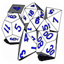

# &nbsp; Game Dice
 4

To use the Game Dice skill, try saying...

* *Alexa, ask Game Dice to roll three ten siders*

* *Alexa, ask Game Dice to roll a six sided die*

* *Alexa, ask Game Dice to roll four d eight*

The Game Dice skill allows Alexa to roll a number of multi-sided dice and announce the resulting total. With Game Dice, Alexa can roll up to 100 dice having anywhere between two and one hundred sizes. For example, asking Game Dice to roll either "three ten-sided dice" or "three ten-siders" will return a number between three and thirty. Game Dice understands the common gaming parlance of referring a ten-sided die as a "d10" (or whatever size die you'd like to have rolled).

***

### Skill Details

* **Invocation Name:** game dice
* **Category:** Games
* **ID:** amzn1.echo-sdk-ams.app.4fba1cb6-dd0d-40ac-b22c-d0604bfa0ba9
* **ASIN:** B019JLD4MG
* **Author:** Amazon
* **Release Date:** December 18, 2015 @ 19:49:10
* **In-App Purchasing:** No
