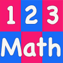

# &nbsp; [1-2-3 Math](http://alexa.amazon.com/#skills/amzn1.echo-sdk-ams.app.2b1d7bfa-c110-4249-a572-ea0d99528873)
 10

To use the 1-2-3 Math skill, try saying...

* *Alexa, Open one two three*

1-2-3 Math, is a math challenge which tests your elementary compute skills, including addition, subtraction, multiplication, division, comparison etc

***

### Skill Details

* **Invocation Name:** one two three
* **Category:** null
* **ID:** amzn1.echo-sdk-ams.app.2b1d7bfa-c110-4249-a572-ea0d99528873
* **ASIN:** B01AVQLZQ0
* **Author:** Shanthan Kesharaju
* **Release Date:** January 20, 2016 @ 19:36:15
* **In-App Purchasing:** No
