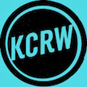

# &nbsp; [KCRW On Air](http://alexa.amazon.com/#skills/amzn1.echo-sdk-ams.app.6be6e402-a417-42d6-aa4b-6efba32d31a6)
 0

To use the KCRW On Air skill, try saying...

* *Alexa, ask KCRW what's playing*

This skill retrieves some information on KCRW.com to give you the current program or track currently playing on KCRW radio.

***

### Skill Details

* **Invocation Name:** k. c. r. w.
* **Category:** Music
* **ID:** amzn1.echo-sdk-ams.app.6be6e402-a417-42d6-aa4b-6efba32d31a6
* **ASIN:** B01AYL0KUY
* **Author:** MTVG
* **Release Date:** January 22, 2016 @ 15:15:22
* **In-App Purchasing:** No
