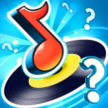

# &nbsp; [Music quiz](http://alexa.amazon.com/#skills/amzn1.echo-sdk-ams.app.bda9cce9-709b-47b7-a623-19989bd1722b)
 6

To use the Music quiz skill, try saying...

* *Alexa launch music quiz*

* *Alexa open music quiz*

* *Alexa start music quiz*

Music quiz is a fun game that you can play to test your music knowledge. Music quiz currently support 4 music styles for a total of 40 songs to (re)discover :)

***

### Skill Details

* **Invocation Name:** music quiz
* **Category:** Music
* **ID:** amzn1.echo-sdk-ams.app.bda9cce9-709b-47b7-a623-19989bd1722b
* **ASIN:** B01BFPCXGW
* **Author:** Vocal Apps
* **Release Date:** February 3, 2016 @ 14:14:28
* **In-App Purchasing:** No
