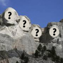

# &nbsp; [Presidential Trivia](http://alexa.amazon.com/#skills/amzn1.echo-sdk-ams.app.eaddcd26-5588-4a34-a435-ec9106a0b908)
 6

To use the Presidential Trivia skill, try saying...

* *Alexa, open Presidential Trivia*

* *Repeat*

* *Help*

It's finally safe to talk about politics! This fun (non-partisan) game will teach you about all of the 44 US presidents as well as bits of trivia about them. Whether you're challenging yourself or trying to beat your know-it-all friend, what you'll learn about the presidents from this game is guaranteed to be trivial and unlikely to be of value in the modern world.

***

### Skill Details

* **Invocation Name:** presidential trivia
* **Category:** Education
* **ID:** amzn1.echo-sdk-ams.app.eaddcd26-5588-4a34-a435-ec9106a0b908
* **ASIN:** B01BO66EM6
* **Author:** onetwentyseven inc
* **Release Date:** February 11, 2016 @ 16:05:59
* **In-App Purchasing:** No
