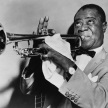

# &nbsp; [Jazz Trivia](http://alexa.amazon.com/#skills/amzn1.echo-sdk-ams.app.a8ea23d9-01b5-4d43-80ef-65a6d17c4d8d)
 0

To use the Jazz Trivia skill, try saying...

* *Alexa, start Jazz Trivia*

* *Alexa, play Jazz Trivia*

* *Alexa, open Jazz Trivia*

Answer multiple-choice questions to test your knowledge of famous jazz musicians, songs, and history.

New questions added all the time!

***

### Skill Details

* **Invocation Name:** jazz trivia
* **Category:** Games
* **ID:** amzn1.echo-sdk-ams.app.a8ea23d9-01b5-4d43-80ef-65a6d17c4d8d
* **ASIN:** B01C7XTYR2
* **Author:** Dart
* **Release Date:** February 25, 2016 @ 18:22:49
* **In-App Purchasing:** No
