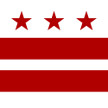

# &nbsp; [D.C. Tech Cal](http://alexa.amazon.com/#skills/amzn1.echo-sdk-ams.app.9920a638-5e86-4ee4-9802-cbe14d60d969)
 0

To use the D.C. Tech Cal skill, try saying...

* *Alexa ask D.C. Tech for news*

* *Alexa ask D.C. Tech for events*

Read the latest Washington DC tech news and events from www.dctechcal.com.
Say: "Alexa ask D.C. Tech for news" or "Alexa, ask D.C. Tech for events"
#dctech

***

### Skill Details

* **Invocation Name:** d. c. tech
* **Category:** Social
* **ID:** amzn1.echo-sdk-ams.app.9920a638-5e86-4ee4-9802-cbe14d60d969
* **ASIN:** B01C9LRW76
* **Author:** Troy Crosby
* **Release Date:** February 26, 2016 @ 19:04:29
* **In-App Purchasing:** No
