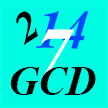

# &nbsp; Greatest Common Divisor (GCD)
 0

To use the Greatest Common Divisor (GCD) skill, try saying...

* *Alexa, open G. C. D.*

* *14 and 17*

* *G. C. D. of 14 and 28*

G. C. D. The greatest common divisor of 2 numbers.  Simply give Alexa 2 numbers and Alexa will respond with the largest number that divides both numbers.

After opening the skill, Alexa with ask for two numbers.  For example, you can reply with '12 and 4', or say G. C. D. of 63 and 4'.

After Alexa responds with the answer, you will be asked: 'Any more numbers?'.  Then you can say '56 and 8'.  Please include the 'and' when telling numbers.  These were only examples of numbers you can use. Alexa can calculate the G. C. D. of any numbers greater than zero.

You can also respond with 'yes' or 'no'.  On 'no', Alexa with close the session, and 'yes' causes Alexa to ask for two numbers again.

***

### Skill Details

* **Invocation Name:** g. c. d.
* **Category:** Education
* **ID:** amzn1.echo-sdk-ams.app.03d9d43e-a8b0-4eba-93ae-260960ae9a6b
* **ASIN:** B01COTHDSG
* **Author:** Don Holmberg
* **Release Date:** March 8, 2016 @ 01:17:18
* **In-App Purchasing:** No
