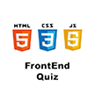

# &nbsp; Frontend Quiz
 0

To use the Frontend Quiz skill, try saying...

* *Alexa, open frontend quiz.*

* *My answer is two.*

* *I don't know this question.*

With the help of Frontend Quiz you can test your HTML, CSS and Javascript knowledge. The level of the questions varies from beginner to intermediate. Play it multiple times and try to achieve maximum score!

***

### Skill Details

* **Invocation Name:** frontend quiz
* **Category:** Education
* **ID:** amzn1.echo-sdk-ams.app.e6e494b6-6a39-48e1-a10d-292430a1cc63
* **ASIN:** B01COZ3HO4
* **Author:** POSSIBLE
* **Release Date:** March 8, 2016 @ 03:20:51
* **In-App Purchasing:** No
