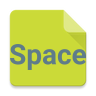

# &nbsp; [Space Trivia Questions](http://alexa.amazon.com/#skills/amzn1.echo-sdk-ams.app.98e3e3c1-2903-4ece-ad64-d2b52e3de803)
 2

To use the Space Trivia Questions skill, try saying...

* *Alexa, launch Space Trivia*

* *Repeat*

* *Help*

Trivia questions about our solar system

***

### Skill Details

* **Invocation Name:** space trivia
* **Category:** null
* **ID:** amzn1.echo-sdk-ams.app.98e3e3c1-2903-4ece-ad64-d2b52e3de803
* **ASIN:** B01CPB5IVC
* **Author:** none
* **Release Date:** March 8, 2016 @ 07:00:41
* **In-App Purchasing:** No
