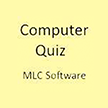

# &nbsp; Computer Quiz
 0

To use the Computer Quiz skill, try saying...

* *Alexa ask computer quiz*

* *Two*

* *Skip*

A quiz on the basics of computers. This skill asks a series of 5 questions each with 4 multiple choice possible answers. Respond with the number for the correct answer to score a point. Alexa will give you the answer if your answer is wrong.

***

### Skill Details

* **Invocation Name:** computer quiz
* **Category:** Education
* **ID:** amzn1.echo-sdk-ams.app.3e75e876-109d-4e8e-8fd2-d715c707bc1b
* **ASIN:** B01D8NYT7K
* **Author:** MLC Software
* **Release Date:** March 21, 2016 @ 07:17:31
* **Privacy Policy:** http://www.communisat.com/alexa/compquiz/privacy.htm
* **Terms of Use:** http://www.communisat.com/alexa/compquiz/termsofuse.htm
* **In-App Purchasing:** No
