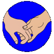

# &nbsp; Your Daily Friend
 1

To use the Your Daily Friend skill, try saying...

* *Alexa, start for me*

* *phrases please*

* *teasers please*

I am your daily friend and can do many things for you.  Such as play fun games and later much more!  Many of the games are great exercise for stretching your mind.

The first time you start this skill, you will be asked for your name.  You can change your name at any time.   For help, say "Help please".   The help will tell you all about the games and how to play them.  

When you are done playing, say "Goodbye".  If you accidentally disconnected, say "Alexa, start for me", and you will be right back where you left off.

***

### Skill Details

* **Invocation Name:** for me
* **Category:** Social
* **ID:** amzn1.echo-sdk-ams.app.d6f2cc48-6018-4b62-82c8-79220013cfb7
* **ASIN:** B01DA0IEFY
* **Author:** SafetyFirst Inc
* **Release Date:** March 22, 2016 @ 04:37:26
* **Privacy Policy:** http://echo.ttinet.com/ydf_privacy.html
* **Terms of Use:** http://echo.ttinet.com/ydf_tandc.html
* **In-App Purchasing:** No
