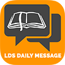

# &nbsp; [LDS Daily Message](http://alexa.amazon.com/#skills/amzn1.echo-sdk-ams.app.2fc76924-38ad-4ca5-bc43-97354be25e46)
 6

To use the LDS Daily Message skill, try saying...

* *Alexa, open LDS Daily Message*

* *Alexa, ask LDS Daily Message for today's message*

* *Alexa, ask LDS Daily Message for a message*

Get your daily dose of spiritual inspiration right from Alexa. LDS Daily Message provides a way to hear the daily LDS Message provided from lds.org. You no longer have to wait for an email or open your computer to start off your day.  LDS Daily Message will read the message aloud and will also provide the message as a Card in the Alexa app any time you ask.  So if you need a little inspiration, go ahead and Ask Alexa to "Open LDS Daily Message."

***

### Skill Details

* **Invocation Name:** l. d. s. daily message
* **Category:** null
* **ID:** amzn1.echo-sdk-ams.app.2fc76924-38ad-4ca5-bc43-97354be25e46
* **ASIN:** B01DBEOE0I
* **Author:** sunkencity software
* **Release Date:** March 23, 2016 @ 00:26:26
* **In-App Purchasing:** No
