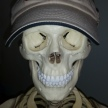

# &nbsp; DoctorBones
 0

To use the DoctorBones skill, try saying...

* *Alexa, open Doctor Bones*

* *Help*

* *Repeat*

Doctor Bones is a medical based trivia game that will challenge you with 5 questions.  The focus of the questions are towards EMS personnel, however many are not above the layperson, nor necessarily below those in more advanced medical professions.

This skill is for fun and informal education purposes only, always verify what you learn before to trust it to be true.  In the event of a real medical emergency always seek qualified and definitive medical care, and/or call 911.  The author expressly disclaims responsibility, and shall have no liability, for any damages, loss, injury, or liability whatsoever suffered as a result of your reliance on the information you may learn by using this app.

***

### Skill Details

* **Invocation Name:** doctor bones
* **Category:** Entertainment
* **ID:** amzn1.echo-sdk-ams.app.2939ff81-102b-4be7-8c98-73681856663b
* **ASIN:** B01DBVXF0Q
* **Author:** kcrowe
* **Release Date:** March 23, 2016 @ 05:48:11
* **In-App Purchasing:** No
