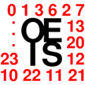

# &nbsp; OEIS-Skill
 1

To use the OEIS-Skill skill, try saying...

* *Alexa, ask o. e. i. s. for a nice sequence*

* *for sequence A123456*

* *to search by terms*

Access the On-Line Encyclopedia of Integer Sequences (OEIS at http://oeis.org). Ask for "a nice sequence"; "search by terms"; ask for an integer sequence by sequence number (e.g., "sequence A235383"); or, ask for a well-known integer sequence (e.g., "the prime numbers", "the Fibonacci numbers", "the digits of pi", etc.).

***

### Skill Details

* **Invocation Name:** o. e. i. s.
* **Category:** Reference
* **ID:** amzn1.echo-sdk-ams.app.7b636bb6-9c90-435e-932f-a6d1d12c2e58
* **ASIN:** B01DC4OET8
* **Author:** Fibonacci Products
* **Release Date:** March 23, 2016 @ 08:37:54
* **In-App Purchasing:** No
