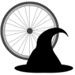

# &nbsp; [Biking Wizard](http://alexa.amazon.com/#skills/amzn1.echo-sdk-ams.app.375fa265-94fa-4201-8621-d67cc548dd9d)
 2

To use the Biking Wizard skill, try saying...

* *Alexa, ask The Biking Wizard if I should go biking in Whistler today*

* *Alexa, ask The Biking Wizard if I should go for a ride in Portland, Oregon*

* *Alexa, ask The Biking Wizard if I should go biking in Malibu*

Biking Wizard checks the weather for you and tells you if the conditions are right for a bike ride today!

***

### Skill Details

* **Invocation Name:** the biking wizard
* **Category:** Sports
* **ID:** amzn1.echo-sdk-ams.app.375fa265-94fa-4201-8621-d67cc548dd9d
* **ASIN:** B01DD9OXDO
* **Author:** ncave
* **Release Date:** March 24, 2016 @ 01:22:31
* **In-App Purchasing:** No
