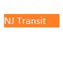

# &nbsp; [NJ Transit Train Schedule](http://alexa.amazon.com/#skills/amzn1.echo-sdk-ams.app.6ae6a7fc-edd1-4706-8d2a-de6d6e7ca94c)
 1

To use the NJ Transit Train Schedule skill, try saying...

* *Alexa ask NJ Transit train when is the next train from New York to Newark Airport*

* *Alexa ask NJ Transit train next train from New York to Newark Airport*

* *Alexa ask NJ Transit train from New York to Newark Airport*

This skill returns the next NJ Transit train that runs from one station to another station.
Current version returns information for next single train.
for example you can say, "Alexa ask NJ Transit train when is the next train from New York to Newark Airport" Current version only supports direct connections.

***

### Skill Details

* **Invocation Name:** n. j. transit train
* **Category:** Travel
* **ID:** amzn1.echo-sdk-ams.app.6ae6a7fc-edd1-4706-8d2a-de6d6e7ca94c
* **ASIN:** B01DE6PG9Q
* **Author:** Mangesh Paranjape
* **Release Date:** March 24, 2016 @ 14:25:57
* **In-App Purchasing:** No
