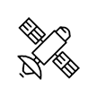

# &nbsp; [Star Trivia](http://alexa.amazon.com/#skills/amzn1.echo-sdk-ams.app.8425453a-b45d-4df9-9198-c8f0212f3d0b)
 0

To use the Star Trivia skill, try saying...

* *Alexa, open Star Trivia*

* *Start new game*

* *My answer is 1*

The user will be asked a series of 5 random questions, all pertaining to Space.

***

### Skill Details

* **Invocation Name:** star trivia
* **Category:** Games
* **ID:** amzn1.echo-sdk-ams.app.8425453a-b45d-4df9-9198-c8f0212f3d0b
* **ASIN:** B01DE9SBR2
* **Author:** playdumbo.nyc
* **Release Date:** March 24, 2016 @ 15:53:10
* **In-App Purchasing:** No
