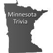

# &nbsp; Minnesota Trivia
 0

To use the Minnesota Trivia skill, try saying...

* *Alexa, open Minnesota Trivia*

* *Yes*

* *No*

Learn more about Minnesota with Minnesota trivia facts.  Even the governor will be surprised by some of these facts!  Just open the Minnesota Trivia application, and it will tell you a fact.

***

### Skill Details

* **Invocation Name:** minnesota trivia
* **Category:** Education
* **ID:** amzn1.echo-sdk-ams.app.2e28c46a-08e0-4192-9d14-cabf6e614cbd
* **ASIN:** B01DF6X1YW
* **Author:** Luppes Consulting, Inc.
* **Release Date:** March 25, 2016 @ 06:43:04
* **Privacy Policy:** http://www.luppes.com/Alexa/Privacy
* **Terms of Use:** http://www.luppes.com/Alexa/TermsOfUse
* **In-App Purchasing:** No
