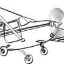

# &nbsp; [My Copilot](http://alexa.amazon.com/#skills/amzn1.echo-sdk-ams.app.8f5b7989-cb58-4355-aec4-3003462073c8)
 0

To use the My Copilot skill, try saying...

* *Alexa, ask My Copilot, what are the clouds at P-A-E*

* *Alexa, ask My Copilot about the clouds at S-L-C*

* *Alexa, tell My Copilot: cloud check B-F-I*

The aspiration of My Copilot is to answer any general aviation question as if you asked ATC that question over the radio. The first area supported is weather, and within weather, you can ask only about cloud cover. (See the sample interactions.) Live weather data is provided by NOAA for stations in North America.

***

### Skill Details

* **Invocation Name:** my copilot
* **Category:** Reference
* **ID:** amzn1.echo-sdk-ams.app.8f5b7989-cb58-4355-aec4-3003462073c8
* **ASIN:** B01DKF311G
* **Author:** Runaway Bamboo LLC
* **Release Date:** March 29, 2016 @ 03:32:36
* **In-App Purchasing:** No
