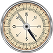

# &nbsp; [Geography Trivia](http://alexa.amazon.com/#skills/amzn1.echo-sdk-ams.app.c571027f-7086-486f-8bee-04018010ec3c)
 2

To use the Geography Trivia skill, try saying...

* *Alexa, open Geography Trivia*

* *Repeat*

* *Help*

Challenging questions, like the following and many more expect you!
"Which city was built in 1908 as the capital of its country as a compromise to the country's two largest cities vying for the honour?"
"Which European capital city is located on the Vltava River and contains both the Charles Bridge and the Wenceslas Square?"

This skill is an entertaining way to test and enhance your geography knowledge. Play it with family and friends for even more fun!

***

### Skill Details

* **Invocation Name:** geography trivia
* **Category:** null
* **ID:** amzn1.echo-sdk-ams.app.c571027f-7086-486f-8bee-04018010ec3c
* **ASIN:** B01DKN053A
* **Author:** umov
* **Release Date:** March 29, 2016 @ 06:54:53
* **In-App Purchasing:** No
