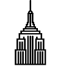

# &nbsp; Empire State Building Colors
 3

To use the Empire State Building Colors skill, try saying...

* *Alexa, Ask Empire State Colors 'What's the colors?'*

* *Alexa, Ask Empire State Colors 'what color is it?'*

* *Alexa, Ask Empire State Colors 'what color is the building?'*

Tired of checking twitter and the web for the ESB colors? This skill will solve your problems. 

Just say, "Alexa, Ask Empire State Colors 'what's the colors'?" and she'll respond with the colors and event/company/holiday ESB is honoring.

Color and honor details are learned from ESB's website. No account necessary.

Pro tip, give it a good NY regional accent. Its just more fun that way.

***

### Skill Details

* **Invocation Name:** empire state colors
* **Category:** Reference
* **ID:** amzn1.echo-sdk-ams.app.e36f1e63-87b6-456c-bbe4-76d2f24b6c87
* **ASIN:** B01DKT3766
* **Author:** daniel ccharobnnet
* **Release Date:** March 31, 2016 @ 17:02:25
* **In-App Purchasing:** No
