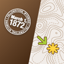

# &nbsp; [Chimani](http://alexa.amazon.com/#skills/amzn1.echo-sdk-ams.app.edee5350-12dd-416a-a5ef-0dbea6f55648)
 0

To use the Chimani skill, try saying...

* *Alexa, ask Chimani what are the ranger events today.*

* *what are the events in Acadia on April 16th.*

* *what are the ranger events in Acadia on April 16th.*

This skill lets you ask Alexa what ranger events are happening in any of the national parks covered by Chimani on a given date in the future.

***

### Skill Details

* **Invocation Name:** chimani
* **Category:** null
* **ID:** amzn1.echo-sdk-ams.app.edee5350-12dd-416a-a5ef-0dbea6f55648
* **ASIN:** B01DKZSOKO
* **Author:** Chimani, LLC
* **Release Date:** April 5, 2016 @ 08:02:25
* **Privacy Policy:** https://www.chimani.com/privacy.html
* **In-App Purchasing:** No
