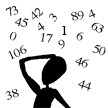

# &nbsp; [Fraction Calculator](http://alexa.amazon.com/#skills/amzn1.echo-sdk-ams.app.4d55fcec-fa5a-4f2f-b62a-4e549bbe03ac)
 2

To use the Fraction Calculator skill, try saying...

* *Alexa, open fraction calculator*

* *add 1 over 2 and 3 over 4*

* *help*

Fraction Calculator

Welcome to the Fraction Calculator.  The calculator will add, subtract,  multiply and divide any fraction.  Simply say the fraction in the form number over number and Alexa will give you the answer.

Guide for invoking the calculator
=================================

Adding:
To add 1/2 and 3/4, say...

add 1 over 2 and 3 over 4
add 1 over 2 plus 3 over 4

Also, you can omit the operation and the calculator will add by default
1 over 2 and 3 over 4
1 over 2 plus 3 over 4

Subtracting:
To subtract 1/2 from 3/4, say...

subtract 1 over 2 from 3 over 4
subtract 1 over 2 plus 3 over 4

Multiplying:
To multiply 1/2 and 3/4, say...

multiply 1 over 2 by 3 over 4
multiply 1 over 2 and 3 over 4
multiply 1 over 2 times 3 over 4

Dividing:
To divide 1/2 and 3/4, say...

divide 1 over 2 by 3 over 4
3 over 4 divides 1 over 2

Help:
You can say....

Help
Help on adding
Help on subtracting
Help on multiplying
help on dividing

Quitting:
Just say quit

===========================

A sample session

Alexa, open fraction calculator
add 1 over 2 and 1 over 4
subtract 1 over 4 from 1 over 2
multiply 1 over 4 by 7 over 8
divide 1 over 2 by 1 over 3
quit

***

### Skill Details

* **Invocation Name:** fraction calculator
* **Category:** Education
* **ID:** amzn1.echo-sdk-ams.app.4d55fcec-fa5a-4f2f-b62a-4e549bbe03ac
* **ASIN:** B01DM4C8VY
* **Author:** Don Holmberg
* **Release Date:** March 30, 2016 @ 05:32:56
* **In-App Purchasing:** No
