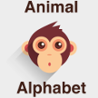

# &nbsp; Animal Alphabet
 2

To use the Animal Alphabet skill, try saying...

* *Alexa, play Animal Alphabet.*

You play the Animal Alphabet game by taking turns with Alexa saying the names of animals for each letter in the alphabet.

HOW TO PLAY:

Your game is automatically saved, so if you leave or run out of time, just say "Alexa, play Animal Alphabet" again to resume your session.

During the game, you can:
* say "wait" to get more time
* say "skip" to go on to the next letter
* say "reset" to start the game over.

----
Logo by Pixel77 (http://www.pixel77.com/) by CC BY-NC-SA 3.0 (http://creativecommons.org/licenses/by-nc-sa/3.0/)

***

### Skill Details

* **Invocation Name:** animal alphabet
* **Category:** Games
* **ID:** amzn1.echo-sdk-ams.app.bddf39d8-87aa-4400-81b8-3707d0b6b07a
* **ASIN:** B01DN0KHM4
* **Author:** Robert Jamison
* **Release Date:** April 4, 2016 @ 01:02:29
* **In-App Purchasing:** No
