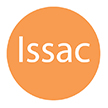

# &nbsp; [Issac for The Division](http://alexa.amazon.com/#skills/amzn1.echo-sdk-ams.app.033d18de-33cd-4478-ae35-98fddfda4510)
 1

To use the Issac for The Division skill, try saying...

* *Alexa, ask Issac for the Daily Missions*

* *Alexa, ask Issac to describe the talent Reckless*

* *Alexa, ask Issac about the skill Support Station*

With this skill you can get information for The Division video game.  At the time of releasing this skill there were 83 gear/weapon/ability talents in the game, and skill can describe them all to you.  It can also tell you what talents can be rolled on a piece of gear, and what the daily missions are.

Some really common phrases you could use would be things like the following:

Alexa, ask Issac how long until reset

Alexa, ask Issac for the Daily Missions
   NOTE: Daily Missions are scraped from Reddit Posts which are done manually by a moderator, so information may take some time after daily reset.

Alexa, ask Issac what talents can I roll on <Knee Pads> 
   NOTE: (change Knee Pads to other types of gear)

Alexa, ask Issac to about the skill <Support Station>
   NOTE: (change Support Station to any skill)

Alexa, ask Issac to about the talent <Vigorous>
   NOTE: (change Vigorous to any talent)

Alexa, ask Issac about <Jessica Kandel>
   NOTE: (You can use any main story character's name here)

Alexa, ask Issac about <Cleaners>
   NOTE: (most of the common jargon in game is defined here, adding more all the time)

***

### Skill Details

* **Invocation Name:** issac
* **Category:** Games
* **ID:** amzn1.echo-sdk-ams.app.033d18de-33cd-4478-ae35-98fddfda4510
* **ASIN:** B01DN3K9KQ
* **Author:** Kissell
* **Release Date:** April 27, 2016 @ 08:08:39
* **Privacy Policy:** http://apps.kissell.net/privacy-policy.html
* **Terms of Use:** http://apps.kissell.net/terms-of-use.html
* **In-App Purchasing:** No
