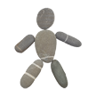

# &nbsp; [PebbleSpot Family Practice Board Review](http://alexa.amazon.com/#skills/amzn1.echo-sdk-ams.app.8b5aaa59-3a30-4f73-9882-3386695a5ab6)
 0

To use the PebbleSpot Family Practice Board Review skill, try saying...

* *Alexa, ask board review questions.*

Quiz yourself and prepare for the Family Medicine Board Exam!  This app uses the questions from the American Board of Family Medicine (ABFM) 2015 In-Service Training Exam (ITE).  It will quiz you on random questions, keep track of your score, and explain the answers to the questions you don't understand.

***

### Skill Details

* **Invocation Name:** board review questions
* **Category:** Education
* **ID:** amzn1.echo-sdk-ams.app.8b5aaa59-3a30-4f73-9882-3386695a5ab6
* **ASIN:** B01DNZK616
* **Author:** PebbleSpot Productions
* **Release Date:** March 31, 2016 @ 06:02:21
* **In-App Purchasing:** No
