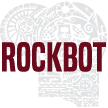

# &nbsp; [RockBot](http://alexa.amazon.com/#skills/amzn1.echo-sdk-ams.app.ad7383c5-6e03-45d8-8a63-c4bedead2196)
 5

To use the RockBot skill, try saying...

* *Alexa, ask The Rock to motivate me.*

* *Alexa, give me an insult from The Rock.*

* *Alexa, ask The Rock for reflection.*

Rockbot brings the wisdom, inspiration, and taunting of Dwayne "The Rock" Johnson to Alexa. Ask for motivation, and you'll hear the perfect quote to help you conquer the world. Want to know a little more about The Rock? Ask for a reflection, and hear about a lesson or memory from his past. 

But if taunting is more your style, ask for an insult and hear one of the classics from his days in the ring, all hilariously delivered in Alexa's voice.

Warning: much like The Rock himself, Rockbot occasionally uses profanity and may not be suitable for all ages.

***

### Skill Details

* **Invocation Name:** the rock
* **Category:** null
* **ID:** amzn1.echo-sdk-ams.app.ad7383c5-6e03-45d8-8a63-c4bedead2196
* **ASIN:** B01DOED528
* **Author:** Sayspring
* **Release Date:** April 4, 2016 @ 06:03:14
* **In-App Purchasing:** No
