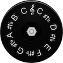

# &nbsp; [Pitch Pipe](http://alexa.amazon.com/#skills/amzn1.echo-sdk-ams.app.c7d2e50e-1ad7-4c0f-b50d-5724d9919caa)
 1

To use the Pitch Pipe skill, try saying...

* *Alexa, ask Pitch Pipe to play C sharp*

* *Alexa, ask Pitch Pipe to play G*

* *Alexa, ask Pitch Pipe to play high E*

Pitch Pipe is a digital chromatic pitch pipe that plays any of the thirteen pitches in an octave, each a half step above the previous. This includes: A flat, A, B flat, B, C, C sharp, D, E flat, E (low and high), F, F sharp, G. 

Use Pitch Pipe as a pitch reference for your singing or instrument tuning. 

To hear a pitch, say "Alexa, ask Pitch Pipe..."

- "to play high E"
- "play the key of C sharp"

Enjoy!

***

### Skill Details

* **Invocation Name:** pitch pipe
* **Category:** Utilities
* **ID:** amzn1.echo-sdk-ams.app.c7d2e50e-1ad7-4c0f-b50d-5724d9919caa
* **ASIN:** B01DOG8U08
* **Author:** Dan Lee
* **Release Date:** April 29, 2016 @ 01:38:41
* **In-App Purchasing:** No
