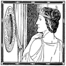

# &nbsp; [Magic Mirror](http://alexa.amazon.com/#skills/amzn1.echo-sdk-ams.app.b298660b-76a0-4e98-9ab6-5f80fb51b495)
 4

To use the Magic Mirror skill, try saying...

* *Alexa, ask Magic Mirror on the wall, who is the fairest one of all?*

* *Magic mirror in my hand, who is the fairest in the land?*

* *who is the fairest one of all?*

Magic Mirror searches world every to day to find out who the fairest one in all the land is. Make it part of your daily routine to find out, by asking.

Magic mirror in my hand, who is the fairest in the land?
Who is the fairest in the land?
Fairest in the land?

Magic mirror on the wall, who is the fairest one of all?
Who is the fairest one of all?
Fairest one of all?

***

### Skill Details

* **Invocation Name:** magic mirror
* **Category:** null
* **ID:** amzn1.echo-sdk-ams.app.b298660b-76a0-4e98-9ab6-5f80fb51b495
* **ASIN:** B01DOHAN1Q
* **Author:** Laynr
* **Release Date:** April 4, 2016 @ 03:32:20
* **In-App Purchasing:** No
