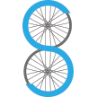

# &nbsp; [Bike Share](http://alexa.amazon.com/#skills/amzn1.echo-sdk-ams.app.09907f8d-f282-427d-8832-2f33fc631908)
 2

To use the Bike Share skill, try saying...

* *Alexa, ask Bike Share to add an address*

* *Alexa, tell bike share to find me a bike*

* *Alexa, tell bike share to change my address*

NOTE: Bike Share only currently supports Citibike in New York City. Stay tuned for support for more bike share systems across the country!

Bike Share allows you to quickly find the closest bike share station to your address with bikes available! Use it on the way out of the house in the morning to avoid walking to an empty station. If a station has less than 3 bikes available, Bike Share will also let you know  the next station that is more populated. 

First, you need to add the address where your Amazon Echo resides. Start by saying:
"Add an Address."

Alexa will prompt you, step by step, to add your address, starting with your house number. For example, if your address was 350 5th Avenue, 10118, when prompted for your house number, you would say "three fifty".

Next, Bike Share will ask for your street name. Using the above example address, you would say "fifth avenue".

Finally, Bike Share will ask for your zip code. In the above example, you would answer, "one zero one one eight".

Once saved, you can then ask at any time to find the closest bike. Just say: "find me a bike."
Alexa will remember your address indefinitely, so you'll never need to add an address again unless you move your Echo. 

If you need to change your address, just tell Bike Share: "change my address". Alexa will ask if you want to overwrite your current address; if you respond "yes", you will be given the chance to enter a new address.

***

### Skill Details

* **Invocation Name:** bike share
* **Category:** null
* **ID:** amzn1.echo-sdk-ams.app.09907f8d-f282-427d-8832-2f33fc631908
* **ASIN:** B01DOI0PKE
* **Author:** Ken Peltzer
* **Release Date:** May 25, 2016 @ 10:38:48
* **Privacy Policy:** http://www.kenpeltzer.com/bikeshare/bike-share-privacy-policy.html
* **In-App Purchasing:** No
