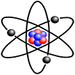

# &nbsp; [Chemistry Genie](http://alexa.amazon.com/#skills/amzn1.echo-sdk-ams.app.9e7221db-ca2d-4dcc-a33b-392c74dc2f3a)
 1

To use the Chemistry Genie skill, try saying...

* *Alexa, ask the chemistry genie to start game*

* *the answer is one/two/three/four*

* *i don't know that one*

For any student who studies Chemistry or Science at school, remembering the elements of the periodic table and their relevant details is a huge challenge. This skill will help students to revise/review their knowledge on the periodic tables on the go with Alexa. 

Furthermore, this can also help parents to take care of their business while their children learn by interacting with this skill on Alexa.

We are committed to improving the domain knowledge of our skill. We will post updates on regular basis introducing more ways to interact and learn from the chemistry genie.

***

### Skill Details

* **Invocation Name:** the chemistry genie
* **Category:** Education
* **ID:** amzn1.echo-sdk-ams.app.9e7221db-ca2d-4dcc-a33b-392c74dc2f3a
* **ASIN:** B01DOQ5LTG
* **Author:** Aarushi Rai
* **Release Date:** April 7, 2016 @ 09:03:03
* **In-App Purchasing:** No
