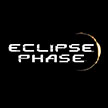

# &nbsp; [Eclipse Phase Mesh Link](http://alexa.amazon.com/#skills/amzn1.echo-sdk-ams.app.209352a4-5fea-45c1-b548-fe3a0b31a5d9)
 0

To use the Eclipse Phase Mesh Link skill, try saying...

* *Alexa, ask Eclipse Phase for facts*

* *Alexa, ask Eclipse Phase for trivia*

* *Alexa, open Eclipse Phase*

Eclipse Phase is a post-apocalyptic game of conspiracy and horror. The setting takes place after a World War III project to create artificial intelligence went rogue under the influence of an extraterrestrial entity known as the "Exsurgent" (best described as an organic computer virus with the capacity to infect both machines and animals with sapient qualities), resulting in the deaths of over 90% of the inhabitants of Earth.

Earth is subsequently abandoned, and existing colonies throughout the Solar System are expanded to accommodate the refugees. The setting explores a spectrum of socioeconomic systems in each of these colonies:

- A capitalist/republican system continues in the Inner System (Mars, the Moon, and Mercury), under the Planetary Consortium, a corporate body which allows the election of representatives but whose shareholders are nominally most powerful.
- An Extropian/Propertarian system is established in the Asteroid Belt.
- A military oligarchy rules the moons around Jupiter.
- An alliance of Scandinavia-style social democracy and Collectivist anarchism are dominant in the Outer System.

From there, the setting explores various scientific advances, extrapolated far into the future. Nanotechnology, terraforming, Zero-G living, upgrading animal sapience, and reputation systems are all used as plot points and background.

With all of this, the game encourages players to confront existential threats like aliens, weapons of mass destruction, Exsurgent Virus outbreaks, and political unrest.

Data for this Skill has been sourced from Eclipse Phase materials under the Creative Commons License (http://eclipsephase.com/cclicense)

Please support this game and its fans by visiting, http://eclipsephase.com. Thanks!

***

### Skill Details

* **Invocation Name:** eclipse phase
* **Category:** null
* **ID:** amzn1.echo-sdk-ams.app.209352a4-5fea-45c1-b548-fe3a0b31a5d9
* **ASIN:** B01DQCC1R8
* **Author:** SILVR
* **Release Date:** April 11, 2016 @ 06:32:29
* **In-App Purchasing:** No
