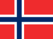

# &nbsp; The Norwegian Quiz
 0

To use the The Norwegian Quiz skill, try saying...

* *Alexa, ask Norse Talk*

* *Alexa, open Norse Talk*

* *Alexa, launch Norse Talk*

A simple but fun quiz about Norway and Norwegians! Both educational and fun!

***

### Skill Details

* **Invocation Name:** norse talk
* **Category:** Games
* **ID:** amzn1.echo-sdk-ams.app.097ac4b5-93d6-4efd-b745-79e4b0d3c539
* **ASIN:** B01DR1A9I6
* **Author:** Fugl
* **Release Date:** April 6, 2016 @ 02:02:35
* **In-App Purchasing:** No
