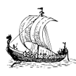

# &nbsp; [Computers Storified in Viking History by Floki](http://alexa.amazon.com/#skills/amzn1.echo-sdk-ams.app.6c0a7537-cf83-452d-9261-680138995511)
 2

To use the Computers Storified in Viking History by Floki skill, try saying...

* *Alexa, ask Floki to tell me something*

* *Alexa, ask Floki full saga*

* *Alexa, open Floki*

Vikings were innovators of technology.  Their impact on western culture is evident in locations like Normandy, Dublin, and discovery of North America before Christopher Columbus.  Illustrating current computer concepts with the story of the Vikings helps to make connections for playful retention of storification.  From Bluetooth to Thor's Day, explore the storytelling method of learning about computers.

Content of CIS150 course, Introduction to Computing, Grand Valley State University.

***

### Skill Details

* **Invocation Name:** floki
* **Category:** Education
* **ID:** amzn1.echo-sdk-ams.app.6c0a7537-cf83-452d-9261-680138995511
* **ASIN:** B01DR4ZFPK
* **Author:** smprof
* **Release Date:** April 8, 2016 @ 16:32:32
* **In-App Purchasing:** No
