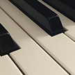

# &nbsp; [Piano Virtuoso](http://alexa.amazon.com/#skills/amzn1.echo-sdk-ams.app.dd691a47-55c9-4f41-8592-b541a574db6f)
 0

To use the Piano Virtuoso skill, try saying...

* *Alexa, ask piano facts for a fun fact*

* *Alexa, open piano facts and help*

* *Alexa, ask piano facts*

Piano Virtuoso

Get fun facts about all things Piano!  This skill is loaded with many surprising facts about the King of Musical Instruments!

Usage guide
==========

Just say: 'Alexa, ask piano facts for a fun fact', or simply: 'Alexa, ask piano facts', or even,' Alexa, open piano facts' and the Amazon Echo will respond with a fun fact related to the piano.  Each time a fact is recited, it will also be printed on the Alexa companion app.

If you need help with the skill, say: Alexa open piano facts and help, and she will give examples on how to ask for a piano fact.

Please enjoy!

***

### Skill Details

* **Invocation Name:** piano facts
* **Category:** Entertainment
* **ID:** amzn1.echo-sdk-ams.app.dd691a47-55c9-4f41-8592-b541a574db6f
* **ASIN:** B01DRDVTNS
* **Author:** Don Holmberg
* **Release Date:** April 7, 2016 @ 05:04:47
* **In-App Purchasing:** No
