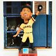

# &nbsp; [Hunter Pence Facts](http://alexa.amazon.com/#skills/amzn1.echo-sdk-ams.app.0f21e587-42bd-4875-a6c3-ab69b38824d2)
 0

To use the Hunter Pence Facts skill, try saying...

* *Alexa, open Hunter Pence facts*

* *Alexa, ask Hunter Pence facts to give me a fact*

* *Alexa, ask Hunter Pence facts to tell me a fact*

"Hunter Pence facts" lists facts about the greatest and weirdest right-fielder of our era, the SF Giants' Hunter Pence. 

Learn about the origins of Hunter Pence facts here: http://knowyourmeme.com/memes/hunter-pence-signs

Or watch the rap music video here: https://www.youtube.com/watch?v=0k-QFXkGzVA

***

### Skill Details

* **Invocation Name:** hunter pence facts
* **Category:** null
* **ID:** amzn1.echo-sdk-ams.app.0f21e587-42bd-4875-a6c3-ab69b38824d2
* **ASIN:** B01DS71H8A
* **Author:** Nicole Holm
* **Release Date:** April 20, 2016 @ 16:02:41
* **In-App Purchasing:** No
