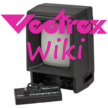

# &nbsp; [Vectrex Wiki](http://alexa.amazon.com/#skills/amzn1.echo-sdk-ams.app.ed68573c-f7f1-467d-94f1-53254b0e0fce)
 0

To use the Vectrex Wiki skill, try saying...

* *Alexa, ask Vectrex Wiki to tell me about the game Bedlam*

* *List all GCE games*

* *Send me game play details about the game Mine Storm*

This skill allows you to get basic information about the original Vectrex GCE games.
It will also retrieve gameplay information from the Vectrex Wikia web site and send it to your Alexa app.

***

### Skill Details

* **Invocation Name:** vectrex wiki
* **Category:** Games
* **ID:** amzn1.echo-sdk-ams.app.ed68573c-f7f1-467d-94f1-53254b0e0fce
* **ASIN:** B01E3IK5LI
* **Author:** KokosApps
* **Release Date:** April 22, 2016 @ 06:08:38
* **In-App Purchasing:** No
