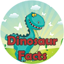

# &nbsp; [Dinosaur Facts](http://alexa.amazon.com/#skills/amzn1.echo-sdk-ams.app.a62131ee-2859-4ce8-9b25-14b5a496b3fd)
 0

To use the Dinosaur Facts skill, try saying...

* *Alexa, Open Dinosaur Facts*

* *Alexa, Launch Dinosaur Facts and tell me a fact*

* *Alexa, Start Dinosaur Facts and give me a fact*

This skill WILL change your life. The amount of dinosaur trivia that will be bouncing around your head will amaze everyone. You will be the life of any party you go to. You will astound your friends. What are you waiting for!?

Contact me at tinystarship.com if you have any questions / comments.

***

### Skill Details

* **Invocation Name:** dinosaur facts
* **Category:** null
* **ID:** amzn1.echo-sdk-ams.app.a62131ee-2859-4ce8-9b25-14b5a496b3fd
* **ASIN:** B01E6072QE
* **Author:** Tiny Starship
* **Release Date:** April 14, 2016 @ 17:32:54
* **In-App Purchasing:** No
