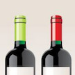

# &nbsp; [wineMate](http://alexa.amazon.com/#skills/amzn1.echo-sdk-ams.app.e68c2c6a-014f-4685-8583-02dbed62fb45)
 0

To use the wineMate skill, try saying...

* *Alexa, ask wine mate what wine goes with bacon?*

* *Alexa, ask wine mate food for a chardonnay wine?*

* *Alexa, ask wine mate what food goes with champagne?*

Looking for what to make tonight to match that special bottle of wine? Having friends coming over that you want to impress? Use Wine Mate to help yourself make the best choice of wine or food.

This skill may not be suitable for all ages as it deals with alcohol. Please use and drink responsibly, and never drink and drive.

***

### Skill Details

* **Invocation Name:** wine mate
* **Category:** Food/Cooking
* **ID:** amzn1.echo-sdk-ams.app.e68c2c6a-014f-4685-8583-02dbed62fb45
* **ASIN:** B01EBUEN0M
* **Author:** Leggett Builds
* **Release Date:** May 10, 2016 @ 09:08:28
* **In-App Purchasing:** No
