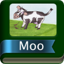

# &nbsp; [Cow Says Moo](http://alexa.amazon.com/#skills/amzn1.echo-sdk-ams.app.51bdd9c6-bed2-48de-95c0-dd2f62514d78)
 0

To use the Cow Says Moo skill, try saying...

* *Alexa ask Cow Says Moo what does the cow say*

* *Alexa start Cow Says Moo*

* *Alexa ask Cow Says Moo what the dog says*

Says Moo will repeat the onomatopoeia to your kids' delight.  In the future, we'll add more animals and even make a quiz out of it to teach your kids animal sounds.

***

### Skill Details

* **Invocation Name:** cow says moo
* **Category:** Education
* **ID:** amzn1.echo-sdk-ams.app.51bdd9c6-bed2-48de-95c0-dd2f62514d78
* **ASIN:** B01ECXTBPK
* **Author:** Autopilot Consulting, LLC
* **Release Date:** April 28, 2016 @ 07:38:31
* **In-App Purchasing:** No
