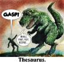

# &nbsp; [Thesaurus Rex](http://alexa.amazon.com/#skills/amzn1.echo-sdk-ams.app.21945954-2a91-4f28-8090-60df94f62be4)
 2

To use the Thesaurus Rex skill, try saying...

* *Alexa ask synonym finder a word for cow*

* *Alexa ask synonym finder how else would I say cat*

* *Alexa ask synonym finder how would an english major say dog*

Use Alexa to give you quick access to synonyms when you need them. Grow your vocabulary, impress your friends and neighbors and most of all sound like an English major.

***

### Skill Details

* **Invocation Name:** synonym finder
* **Category:** Productivity
* **ID:** amzn1.echo-sdk-ams.app.21945954-2a91-4f28-8090-60df94f62be4
* **ASIN:** B01EDTE3G0
* **Author:** BLT Robotics
* **Release Date:** May 21, 2016 @ 04:38:34
* **In-App Purchasing:** No
