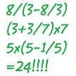

# &nbsp; [TwentyFour](http://alexa.amazon.com/#skills/amzn1.echo-sdk-ams.app.1265a11a-faad-4aec-8590-897f6f7452fb)
 1

To use the TwentyFour skill, try saying...

* *Alexa, ask Twentyfour master to give me four numbers*

* *Alexa, ask Twentyfour master to generate four numbers*

* *Alexa, ask Twentyfour master to play the game*

Twenty four is a game to use four number from 1-13 to calculate the number 24. Each number will be used once and only once. You can use +, -, *, / and (). The skill will give you four numbers that for sure will have at least one answer.

***

### Skill Details

* **Invocation Name:** twenty four master
* **Category:** null
* **ID:** amzn1.echo-sdk-ams.app.1265a11a-faad-4aec-8590-897f6f7452fb
* **ASIN:** B01EFDFPDO
* **Author:** NukePrice
* **Release Date:** May 16, 2016 @ 06:08:32
* **In-App Purchasing:** No
