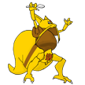

# &nbsp; [Dex Trivia](http://alexa.amazon.com/#skills/amzn1.echo-sdk-ams.app.34b4784b-1abc-4011-bf8d-6bdddb056671)
 2

To use the Dex Trivia skill, try saying...

* *Alexa, start dex trivia*

* *The answer is one*

* *One*

Dex Trivia is a multiple choice trivia game for Pokemon that tests your knowledge of the Pokedex.  Are you the best, like no one ever was?  Find out with this game!

***

### Skill Details

* **Invocation Name:** dex trivia
* **Category:** null
* **ID:** amzn1.echo-sdk-ams.app.34b4784b-1abc-4011-bf8d-6bdddb056671
* **ASIN:** B01EGB0FNU
* **Author:** Shwheelz
* **Release Date:** May 6, 2016 @ 07:38:31
* **In-App Purchasing:** No
