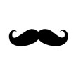

# &nbsp; [Manly Quotes](http://alexa.amazon.com/#skills/amzn1.echo-sdk-ams.app.2a2c9663-a89b-4ffa-8754-e74c2f8ca332)
 1

To use the Manly Quotes skill, try saying...

* *Alexa, ask Manly Quotes for a quote.*

* *Alexa, ask Manly Quotes for something.*

* *Alexa, ask Manly Quotes to tell me a manly quote.*

Looking for a manly quote to inspire and motivate? Ask Manly Quotes!

***

### Skill Details

* **Invocation Name:** manly quotes
* **Category:** null
* **ID:** amzn1.echo-sdk-ams.app.2a2c9663-a89b-4ffa-8754-e74c2f8ca332
* **ASIN:** B01EI88ULK
* **Author:** Screen Four
* **Release Date:** April 28, 2016 @ 19:38:29
* **In-App Purchasing:** No
