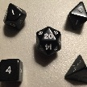

# &nbsp; [Dungeon Dice](http://alexa.amazon.com/#skills/amzn1.echo-sdk-ams.app.43e64c2b-9f81-42f6-9a16-c3f4b273f5d8)
 4

To use the Dungeon Dice skill, try saying...

* *Alexa, ask dungeon dice to roll a d20.*

* *roll a 10*

* *for a d20*

In need of some dice? Dungeon dice can roll a random 4-sided, 6-sided, 8-sided, 10-sided and 20-sided dice for you. This skill is intended to be a fast, easy way to generate random dice rolls, wether you're playing a game with friends or just looking for some random dice! You can ask Alexa for dice rolls with the formal "D" or without. For example "Roll a d20" works just as well as "Roll a 20."

***

### Skill Details

* **Invocation Name:** dungeon dice
* **Category:** null
* **ID:** amzn1.echo-sdk-ams.app.43e64c2b-9f81-42f6-9a16-c3f4b273f5d8
* **ASIN:** B01EK2OZSG
* **Author:** DaveDev Productions
* **Release Date:** April 21, 2016 @ 18:38:30
* **In-App Purchasing:** No
